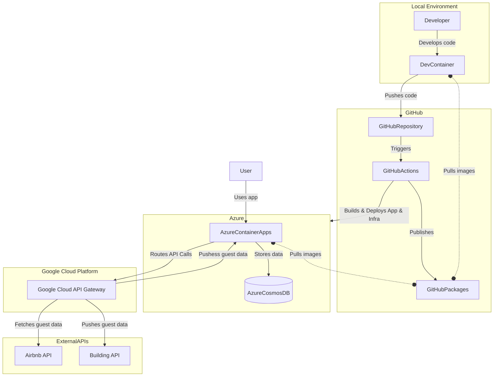

# 📌 Project Architecture

This document describes the architecture of the Guest Registration System, including its key components and their interactions.

## 🔹 System Architecture Diagram

## 🏗️ Architecture Components

- **Frontend:** A Vue.js-based application hosted on **Azure Static Web Apps**, allowing guests to register their details.
- **API Gateway:** **Google Cloud API Gateway** handles requests, integrates with external APIs.
- **Backend:** An API deployed on **Azure Container Apps**, handling form submissions and retrieving guest data.
- **Database:** **Azure Cosmos DB** is used to store guest information in a scalable, serverless manner.
- **CI/CD Pipeline:** GitHub Actions automates testing, linting, and deployment of the application.